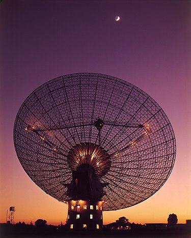

# Estimarea Direcției unui Semnal

----

----

---

# Ce semnale vom prelucra?

----

## Cum le obținem?

----

# Simularea vine însă cu dificultăți tehnice 

----

## Dificultatea #1

----

# Docker

----

## Dockerfile 

- Imagine de bază: python:3.11.7-bookworm
- User special pentru a rula aplicația
- Am adăugat toate bibliotecile necesare din fișierul `requirements.txt`

----

## docker-compose

- `platform: linux/amd64`
- Volumes pentru a putea rula modificările din cod "on the go"

----

## Dificultatea #2

----

## .npy for the win!

- De fiecare dată cand rulez o nouă configurație de receptori / semnale salvez outputul pentru caching
- În viitor, refolosesc datele pentru timp mici de rulare

---

## Implementare algoritmi

----

## Range-Doppler FFT

- FFT pentru transformare in domeniul frecvenței
- O fereastră pentru procesarea distanței
- O fereastră pentru procesarea vitezei
- Alegem cele mai puternice semnale - indică prezența unor potențiale obiecte în spațiu
- Normalizăm semnalele pentru a extrage unghiul de sosire

----

## MUSIC

- Un algoritm renumit în domeniu

----

## MUSIC

----

## MUSIC

- Analiza asupra matricei de covarianță
- Extragem componentele care corespund zgomotului ambiental
- Folosim un vector de directivitate pe intreg spectrul de unghiuri posibile si obtinem spectru
- Maximele locale reprezintă obiectele identificate

----

## Root-MUSIC

- Se începe tot de la matricea de covarianță
- Se elimină zgomotul de fundal
- Se folosesc componentele de zgomot pentru a forma un polinom caracteristic
- Obținem radăcinile poligonului, si le eliminăm pe cele ce nu se află în interiorul cercului trigonometric
- Calculăm sinusurile unghiurilor asociate rădăcinilor și de aici obținem unghiurile

----

## ESPIRIT

- Descompunem matricea de covarianță în valori si vectori proprii
- Ne concentrăm asupra vectorilor proprii cu cele mai mari valori proprii asociate
- Calculăm matricea de transformare `phi` (invarianța rotațională)
- Determinăm fazele valorilor proprii matricei `phi` și de aici scoatem unghiurile

---

## Compararea algoritmilor

----

## Acuratețe

----

## Acuratețe - Un Singur Obiect

| Range Doppler FFT | MUSIC | Root-MUSIC | ESPIRIT |
| ----------------- | ----- | ---------- | ------- |
| 0.8453 % | <0.0001 % | 0.0668 % | 0.1950 % |

----

## Acuratețe - Trei Obiecte

| Range Doppler FFT | MUSIC | Root-MUSIC | ESPIRIT |
| ----------------- | ----- | ---------- | ------- |
| 12.01 % | <0.0001% | 0.44 % | 1.17 % |
| 372.05 % | <0.0001% | 0.0749 % | 0.7684 % |
| 0.3060 % | <0.0001% | 0.0858 % | 0.1025 % |

----

## Eroare Relativa 372.50%

----

## De ce?

DEMO TIME!

----

## Putere computațională necesară / Timp de rulare

----

## Putere computațională necesară / Timp de rulare

Aici caching-ul s-a dovedit util, reducând timpul de rulare total de la 1h27m la 1-2m.

----

## Putere computațională necesară / Timp de rulare

| Range Doppler FFT | MUSIC | Root-MUSIC | ESPIRIT |
| ----------------- | ----- | ---------- | ------- |
| 10s | 0.755s | 5.809s | 0.172s |

---

## Concluzii

- Range-Dopple FFT s-a clasat ultimul la ambele comparații
- MUSIC vs ESPIRIT - Acuratețe vs Latență

---

## Bibliografie

Prezentare:

DALL-E (toate pozele cu excepția primelor două + meme)

https://www.meme-arsenal.com/create/meme/2328320

https://en.wikipedia.org/wiki/File:CSIRO_ScienceImage_4350_CSIROs_Parkes_Radio_Telescope_with_moon_in_the_background.jpg

http://commons.wikimedia.org/wiki/File:F-117_Nighthawk_Front.jpg

Proiect:

https://www.iaeng.org/publication/IMECS2008/IMECS2008_pp1507-1510.pdf

https://ieeexplore.ieee.org/document/9068230/authors#authors

https://eprints.gla.ac.uk/181144/1/181144.pdf

https://radarsimx.com/radarsimx/radarsimcpp/

https://www.mdpi.com/1424-8220/21/17/5933

https://en.wikipedia.org/wiki/Estimation_of_signal_parameters_via_rotational_invariance_techniques.

https://en.wikipedia.org/wiki/MUSIC_(algorithm)

---

# Q&A

Mulțumesc pentru atenție!